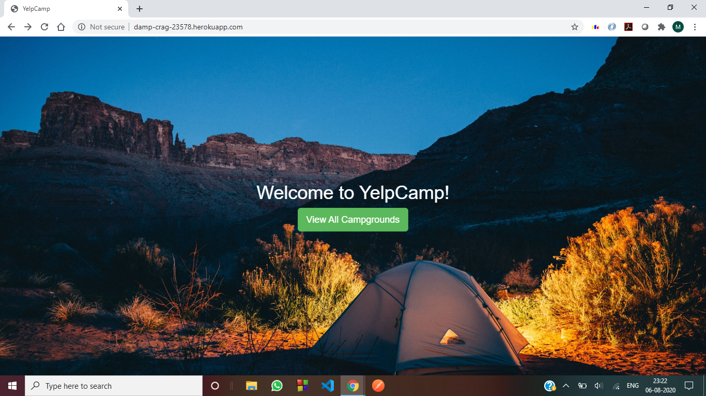
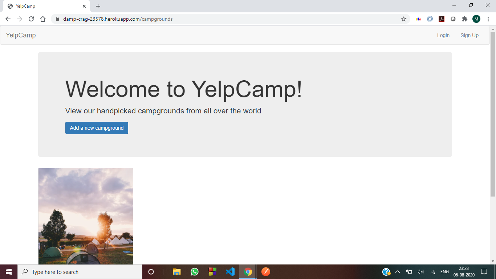
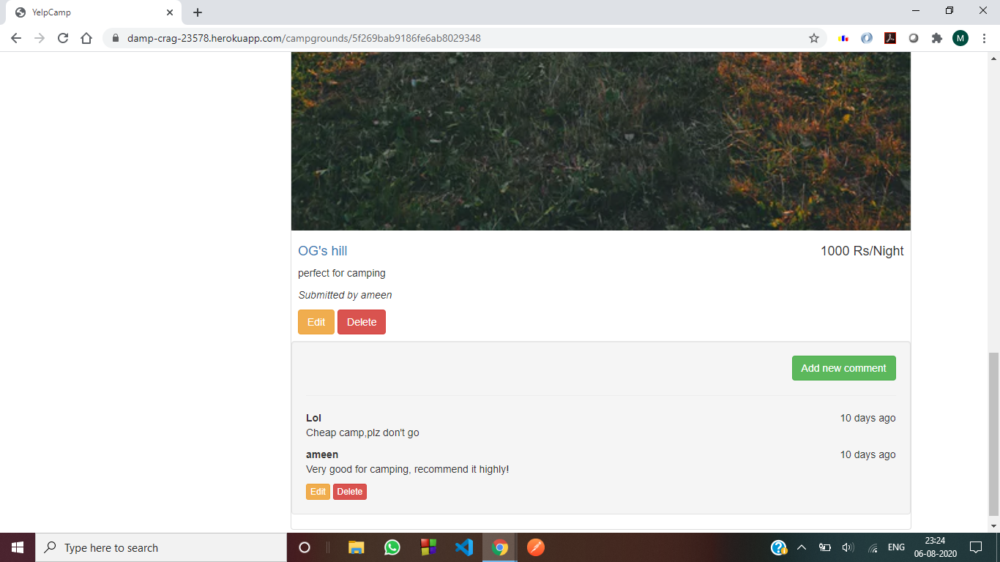

# Yelpcamp

A full stack website to explore various campgrounds/camping sites. This is built using
NodeJS, Express, MongoDB(for database) and Bootstrap. It has various features like user
login, authentication, comment section etc. This website is deployed using Heroku.

Link to the website :- https://damp-crag-23578.herokuapp.com/

## Screenshots of the website

#### Landing Page :-

#### Campgrounds page :-

#### More Info page and comment section :-

